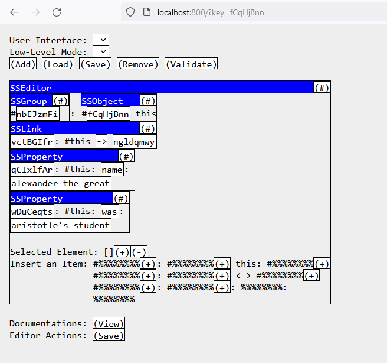

# Systemstate Editor

Customizable user interfaces to interact with hypergraphs. Hypergraphs are a highly versatile data structure that can represent almost any kind of data. Here, hypergraphs are conceptualized into four kinds of items (**SSObject**s, **SSGroup**s, **SSLink**s and **SSProperty**s respectively): 

The hashtags (#) represent things that you can select to interact with: 

The boxes you see are windows that display various user interfaces. You can change which user interface is used to load the same data into your browser: 

The user interfaces are all based on the same API. By following the API, arbitrary user interfaces can be created to interact with the hypergraphs, with as much customizability as you want. 