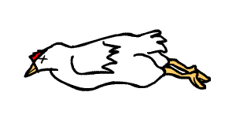

# Systemstate Editor

## A Developmental Dead-End

Due to the inherent limitations of Systemstate Editor's architecture, not much further progress could be made beyond this point. We eventually decided to call it a developmental dead-end and rewrite the entire Systemstate Editor with a new architecture, in order to eventually turn the user interface feature into reality. 

